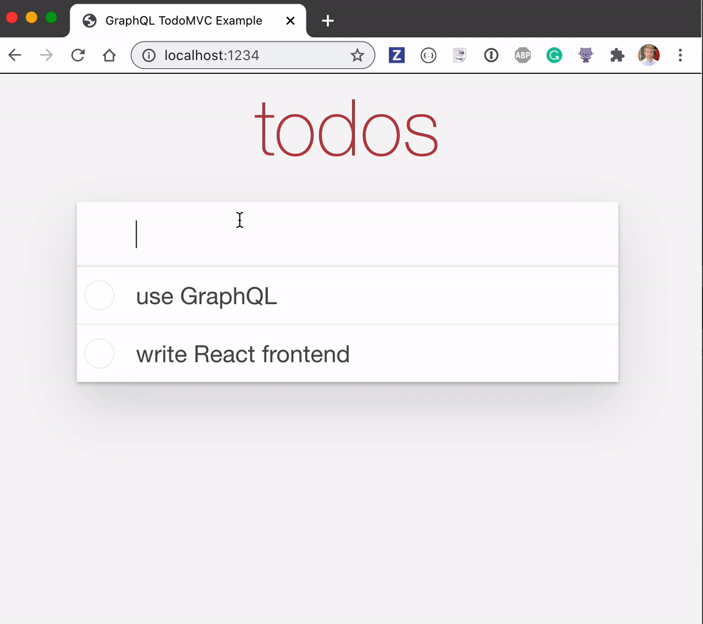

# todo-graphql-example 
[](https://circleci.com/gh/bahmutov/todo-graphql-example) [![badges status][badges image]][badges url] [![renovate-app badge][renovate-badge]][renovate-app]

Read [Smart GraphQL Stubbing in Cypress](https://glebbahmutov.com/blog/smart-graphql-stubbing/)

## App

Start server with `npm start`. You can find GraphQL playground at `http://localhost:3000`



Example asking for all todos

```
query {
  allTodos {
    id,
    title,
    completed
  }
}
```

Response

```json
{
  "data": {
    "allTodos": [
      {
        "id": "1",
        "title": "do something",
        "completed": false
      },
      {
        "id": "2",
        "title": "another",
        "completed": false
      }
    ]
  }
}
```

Example creating new todo object

```
mutation {
  createTodo(id: 2, title: "another", completed: false) {
    id
  }
}
```

Response

```json
{
  "data": {
    "createTodo": {
      "id": "2"
    }
  }
}
```

Example asking for a single todo (notice `id` argument)

```
query {
  Todo(id: 2) {
    id,
    title,
    completed
  }
}
```

Response

```json
{
  "data": {
    "Todo": {
      "id": "2",
      "title": "another",
      "completed": false
    }
  }
}
```

## Development

Backend is [json-graphql-server](https://github.com/marmelab/json-graphql-server). Front-end React code is in [src](src) folder, modeled after [Getting Started With React And GraphQL](https://medium.com/codingthesmartway-com-blog/getting-started-with-react-and-graphql-395311c1e8da) post.

## Cypress testing using fetch

By mocking it using `json-graphql-server` completely: see [cypress/integration/spec.js](cypress/integration/spec.js) file.

By mocking network calls using [cy.intercept](https://on.cypress.io/intercept) see [cypress/integration/intercept-spec.js](cypress/integration/intercept-spec.js)

By mocking network calls using `routeG` see [cypress/integration/routeG-spec.js](cypress/integration/routeG-spec.js)

Spec [cypress/integration/client-spec.js](cypress/integration/client-spec.js) is testing making individual GraphQL calls using app's own client

Spec [cypress/integration/ui-spec.js](cypress/integration/ui-spec.js) has simple tests that do not depend on the network, and thus are hard to write

[renovate-badge]: https://img.shields.io/badge/renovate-app-blue.svg
[renovate-app]: https://renovateapp.com/
[badges image]: https://github.com/bahmutov/todo-graphql-example/workflows/badges/badge.svg?branch=master
[badges url]: https://github.com/bahmutov/todo-graphql-example/actions
